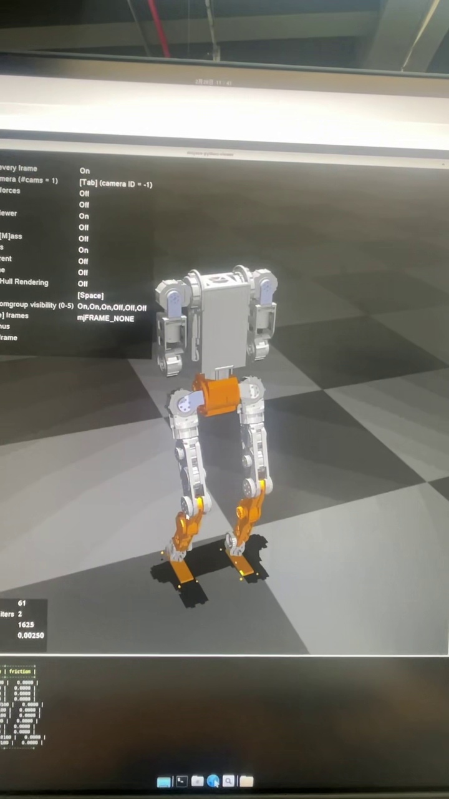
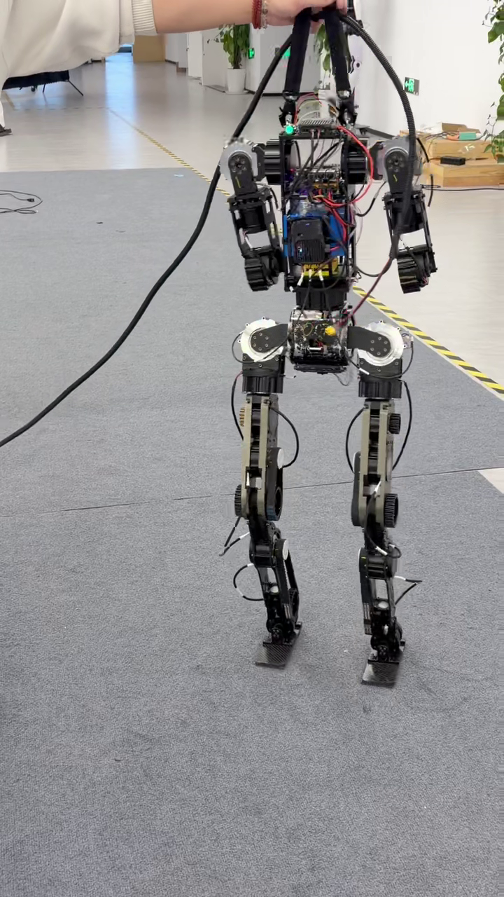

# Droid

`Droid` 是上海卓益得机器人 `E1` 的训练与部署项目，围绕 DroidUP / E1 机器人构建统一工作区，覆盖从强化学习训练到策略部署验证的完整链路：

`IsaacLab / IsaacSim 训练 -> 策略导出 -> MuJoCo sim2sim -> gRPC sim2real(fake) / 真机接口复用`

仓库当前保留两个目录：

- `Droid_lab`：训练、策略导出、sim2sim、sim2real 控制端
- `droidup_mujoco`：MuJoCo 仿真与 gRPC 假后端，用于复用真机控制接口

## 演示视频

[](media/sim2sim.mp4)

[](media/sim2real.mp4)

## 1. 项目目标

本项目面向上海卓益得机器人 `E1` 的 locomotion 策略训练与部署，同时保留对 `E1_DOG`、`G1`、`anymal_d` 等任务配置的兼容结构。重点是把训练、仿真验证和部署验证串成一条连续工作流。

目前仓库中已经存在的主要机器人与任务包括：

- `E1_flat`
- `E1_rough`

## 2. 总体流程

```text
Droid_lab/legged_lab
  └─ IsaacLab 中定义任务、奖励、地形、传感器与训练脚本
       └─ 产出 logs/<experiment>/<timestamp>/
            ├─ params/env.yaml
            ├─ params/agent.yaml
            └─ checkpoint
                 └─ 导出 policy.onnx / policy.pt
                      └─ 同步到 Droid_lab/deploy/policies/
                           ├─ policy.onnx
                           └─ env_cfg.json
                                ├─ sim2sim: Droid_lab/deploy/sim2mujo_*.py
                                └─ sim2real(fake): droidup_mujoco + Droid_lab/deploy/sim2real_*.py
```

## 3. 目录结构

```text
Droid/
├─ README.md
├─ PROJECT_ANALYSIS.md
├─ PROJECT_STRUCTURE.md
├─ Droid_lab/
│  ├─ setup.py
│  ├─ legged_lab/
│  │  ├─ assets/
│  │  ├─ envs/
│  │  ├─ mdp/
│  │  ├─ scripts/
│  │  ├─ terrains/
│  │  └─ utils/
│  └─ deploy/
│     ├─ base/
│     ├─ policies/
│     ├─ protos/
│     ├─ script/
│     ├─ tools/
│     ├─ sim2mujo_E1.py
│     ├─ sim2mujo_E1_DOG.py
│     ├─ sim2mujo_G1.py
│     ├─ sim2real_E1.py
│     ├─ sim2real_E1_DOG.py
│     └─ ...
└─ droidup_mujoco/
   ├─ assets/
   ├─ recordings/
   ├─ res/
   ├─ simulate/
   ├─ test/
   ├─ mjmodel.xml
   ├─ MJMODEL.TXT
   └─ MJDATA.TXT
```

## 4. 模块职责

### `Droid_lab`

负责训练与部署主链路：

- `legged_lab/scripts/train.py`：训练入口
- `legged_lab/scripts/play.py`：IsaacLab 内回放
- `legged_lab/scripts/play_mujo.py`：策略导出与 MuJoCo 联调入口
- `deploy/sim2mujo_*.py`：ONNX 策略在 MuJoCo 中运行
- `deploy/sim2real_*.py`：通过机器人接口运行策略
- `deploy/tools/update_policies.py`：把训练目录中的 `policy.onnx` 和 `env.yaml` 同步到 `deploy/policies/`

### `droidup_mujoco`

负责 MuJoCo gRPC 假后端：

- `simulate/droidup_mujoco.py`：启动 MuJoCo + gRPC 服务
- `simulate/configs/*.json`：关节、PD、默认姿态、控制周期配置
- `test/leg_base_test.py`：验证腿部 gRPC 接口
- `test/arm_base_test.py`：验证手臂 gRPC 接口

## 5. 推荐环境

训练侧和 MuJoCo/部署侧建议使用两个独立环境。

### 5.1 训练环境

建议：

- Linux
- Python `3.11`
- Isaac Sim `5.1.0`
- Isaac Lab `2.2.0`
- RSL-RL

示例：

```bash
conda create -n droid_train python=3.11
conda activate droid_train

# 先按 Isaac Lab 官方方式安装 Isaac Sim / Isaac Lab
# 然后安装本地训练包
cd Droid_lab
pip install -e .
```

### 5.2 MuJoCo / 部署环境

建议：

- Python `3.10`
- `mujoco`
- `mujoco-python-viewer`
- `onnxruntime`
- `numpy`
- `scipy`
- `grpcio==1.65.4`
- `grpcio-tools==1.65.4`
- `protobuf==5.28.0`
- `tqdm`
- `pynput`
- DroidUP SDK 对应的 `droidup_api` / `droidup_client`

示例：

```bash
conda create -n droid_bridge python=3.10
conda activate droid_bridge

pip install mujoco mujoco-python-viewer onnxruntime numpy scipy tqdm pynput
pip install grpcio==1.65.4 grpcio-tools==1.65.4 protobuf==5.28.0

# 再从 DroidUP SDK 发布包安装以下依赖
# pip install droidup_api-*.whl
# pip install droidup_client-*.whl
```

## 6. 快速开始

### 6.1 训练策略

在 `Droid_lab` 目录下运行：

```bash
cd Droid_lab
python legged_lab/scripts/train.py --task=E1_flat --headless --logger=tensorboard --num_envs=4096
```

训练产物默认输出到：

```text
Droid_lab/logs/<experiment>/<timestamp>/
```

### 6.2 在 IsaacLab 中回放

```bash
cd Droid_lab
python legged_lab/scripts/play.py --task=E1_flat --num_envs=1
```

### 6.3 导出策略到部署目录

目标产物是：

```text
Droid_lab/deploy/policies/policy.onnx
Droid_lab/deploy/policies/env_cfg.json
```

`legged_lab/scripts/play_mujo.py` 中已经包含导出 ONNX 与同步配置的逻辑，并会调用 `deploy/tools/update_policies.py`。  
但当前分支里该脚本引用了缺失模块 `deploy.sim2mujo_x2r`，因此它在现状下不一定能直接运行。

如果你修复该引用，导出流程的核心目标就是：

- 从训练目录导出 `policy.onnx`
- 从 `params/env.yaml` 生成 `deploy/policies/env_cfg.json`

仓库当前已经存在一份可用的部署文件：

```text
Droid_lab/deploy/policies/policy.onnx
Droid_lab/deploy/policies/env_cfg.json
```

### 6.4 sim2sim：在 MuJoCo 中运行策略

以 E1 为例：

```bash
cd Droid_lab/deploy
python sim2mujo_E1.py
```

其他入口包括：

- `python sim2mujo_E1_DOG.py`
- `python sim2mujo_G1.py`

这些脚本会读取：

- `policies/policy.onnx`
- `policies/env_cfg.json`

并将 IsaacLab 的关节顺序映射到 MuJoCo 关节顺序。

### 6.5 sim2real(fake)：真机接口复用 + 仿真后端

这个模式下，控制端仍然走 `sim2real_*.py` 的机器人接口，但实际后端不是实机，而是 `droidup_mujoco` 提供的 MuJoCo gRPC 服务。

终端 1：

```bash
cd droidup_mujoco
python simulate/droidup_mujoco.py
```

终端 2：

```bash
cd Droid_lab/deploy
python sim2real_E1.py
```

如果要验证四足或其他模型，替换为对应的 `sim2real_*.py` 脚本。

### 6.6 仅验证 MuJoCo gRPC 服务

启动仿真服务：

```bash
cd droidup_mujoco
python simulate/droidup_mujoco.py
```

腿部接口测试：

```bash
cd droidup_mujoco
python test/leg_base_test.py --host localhost --port 50051
```

手臂接口测试：

```bash
cd droidup_mujoco
python test/arm_base_test.py --host localhost --port 50052
```

## 7. 关键文件说明

- `Droid_lab/legged_lab/envs/__init__.py`
  - 注册所有任务名
- `Droid_lab/legged_lab/scripts/train.py`
  - 启动 IsaacLab 训练
- `Droid_lab/legged_lab/scripts/play.py`
  - 载入已有策略做回放
- `Droid_lab/legged_lab/scripts/play_mujo.py`
  - 导出策略并准备 MuJoCo 工作流
- `Droid_lab/deploy/tools/update_policies.py`
  - 从日志目录抽取部署所需文件
- `Droid_lab/deploy/sim2mujo_E1.py`
  - E1 的 sim2sim 入口
- `Droid_lab/deploy/sim2real_E1.py`
  - E1 的 sim2real 控制端入口
- `droidup_mujoco/simulate/droidup_mujoco.py`
  - MuJoCo gRPC 假后端入口

## 8. 已知问题

- 历史文档存在编码问题，旧版中文 `readme` 打开时可能显示乱码。
- `Droid_lab/legged_lab/scripts/play_mujo.py` 当前引用了仓库中不存在的 `deploy.sim2mujo_x2r`。
- `Droid_lab/deploy/script/deploy_rl.sh` 中引用的 `sim2real_x2r.py` 当前仓库中未发现。
- 因为训练环境与部署环境依赖差异较大，强烈建议分开管理 conda 环境。

## 9. 建议的最小验证闭环

1. 在 `Droid_lab` 中完成一次训练，确认 `logs/<experiment>/<timestamp>/` 正常生成。
2. 确认 `Droid_lab/deploy/policies/` 下存在 `policy.onnx` 和 `env_cfg.json`。
3. 运行 `Droid_lab/deploy/sim2mujo_E1.py`，验证 sim2sim。
4. 启动 `droidup_mujoco/simulate/droidup_mujoco.py`。
5. 再运行 `Droid_lab/deploy/sim2real_E1.py`，验证 sim2real(fake) 控制闭环。

## 10. 备注

仓库根目录下的 `PROJECT_ANALYSIS.md` 与 `PROJECT_STRUCTURE.md` 是补充分析文档，可作为理解当前工程结构的参考，但以本 `README.md` 作为统一入口说明。
